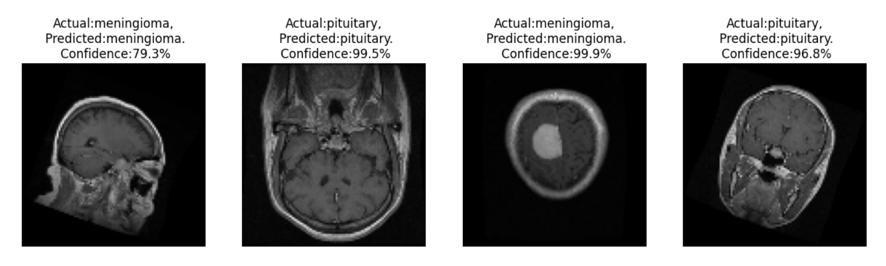

# **🧠 Brain Tumor Classification Using Deep Learning**

## **Overview**
This project aims to develop a deep learning model to classify brain MRI images into four categories:

- Glioma
- Meningioma
- Pituitary Tumor
- No Tumor (Normal)

We developed and compared multiple deep learning models, including custom-designed CNNs and popular pre-trained architectures, to find the most effective solution for accurate brain tumor diagnosis

## **Dataset**
- Source - [Kaggle](https://www.kaggle.com/datasets/rishiksaisanthosh/brain-tumour-classification)
- Classes
    - Glioma
    - Meningioma
    - Pituitary Tumor
    - No Tumor (Normal)
- Data type - MRI Images(jpeg)
- The dataset consists of 18279 images across 4 classes (tumor types)

## **Preprocessing**
- Resize the Images
- Normalizing Pixel Values
- Data augumentation (Rotation,Fliping,...)

## **Model Used**
- Deeplearning models
    - Custom CNN model
    - CNN - GRU Model
    - Alexnet
- Pretrained model
    - VGG 16
    - VGG 19
    - Mobile Netv2
    - Restnet 101
    - Inception V3
    - Efficient Net
    All pre-trained models were fine-tuned on the brain tumor dataset


## **Best Model: Custom CNN**
After evaluation, the Custom CNN Model outperformed all other models, achieving the highest accuracy and generalization ability on unseen MRI images

## **Project Work flow**
```markdown
1. Load and Preprocess Dataset
2. Build and Train Multiple Models
3. Fine-tune Pre-trained Models
4. Evaluate and Compare Model Performance
5. Deploy Best Model (Custom CNN) for Prediction
```
## **Model Architecture (Custom CNN)**
- Input Layer (input: 32x100×100×3)
- Multiple Convolutional + MaxPooling Layers
- Batch Normalization
- Dropout Layers
- Flatten Layer
- Fully Connected Dense Layers
- Output Layer (Softmax with 4 nodes)

## **Training validation accuracy graph in custom cnn model**


## **Testing New Data**



